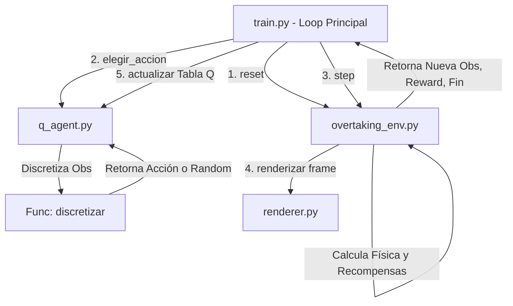

# Modelado de Overtaking (Adelantamiento Inteligente) con Q-Learning

Este documento detalla la formulación matemática y de ingeniería utilizada para resolver el problema de adelantamiento inteligente empleando **Q-Learning Tabular** sobre un entorno personalizado en Gymnasium.

---

## 1. El Entorno de Aprendizaje (OvertakingEnv)

El entorno simula una carretera de dos carriles con tres agentes principales:
1. **El Agente (Vehículo Azul):** Controlado por el algoritmo de aprendizaje.
2. **El Vehículo Lento (Naranja):** Circula delante del agente en el carril derecho.
3. **El Vehículo Contrario (Rojo):** Circula de frente en sentido opuesto en el carril izquierdo.

### 1.1. Espacio de Observaciones (Entradas del Agente)
El agente percibe el estado del mundo a través de un vector de **6 observaciones continuas**, normalizadas estrictamente en el rango $[0, 1]$:

| Índice | Variable | Rango Real | Fórmula de Normalización | Significado en el Algoritmo |
| :---: | :--- | :---: | :---: | :--- |
| **`0`** | `dist_lento` | $0\text{ a }200\text{ m}$ | $\text{clip}\left(\frac{\Delta x_{\text{lento}}}{200}, 0, 1\right)$ | Distancia relativa al vehículo de delante. |
| **`1`** | `vel_agente` | $5\text{ a }40\text{ m/s}$ | $\frac{v_{\text{agente}} - 5}{35}$ | Velocidad de nuestro vehículo ($18\text{ a }144\text{ km/h}$). |
| **`2`** | `vel_lento` | $5\text{ a }40\text{ m/s}$ | $\frac{v_{\text{lento}} - 5}{35}$ | Velocidad del vehículo lento que se quiere adelantar. |
| **`3`** | `dist_contrario` | $0\text{ a }400\text{ m}$ | $\text{clip}\left(\frac{\Delta x_{\text{contrario}}}{400}, 0, 1\right)$ | Distancia relativa al vehículo que viene de frente. |
| **`4`** | `vel_contrario` | $5\text{ a }40\text{ m/s}$ | $\frac{v_{\text{contrario}} - 5}{35}$ | Velocidad de aproximación del vehículo en contra. |
| **`5`** | `carril` | $\{0, 1\}$ | $0.0\text{ o }1.0$ | Carril actual del agente ($0 = \text{Derecho}, 1 = \text{Izquierdo}$). |

### 1.2. Espacio de Acciones (Salidas del Agente)
En cada paso de tiempo ($dt = 0.1\text{ segundos}$), el agente evalúa el estado y toma una de las siguientes **4 acciones discretas**:

* **`0` $\rightarrow$ Frenar:** Reduce la velocidad del agente en $-2.0\text{ m/s}$ (cuidando no bajar del mínimo de $5.0\text{ m/s}$).
* **`1` $\rightarrow$ Mantener:** Mantiene la velocidad actual constante.
* **`2` $\rightarrow$ Acelerar:** Incrementa la velocidad del agente en $+2.0\text{ m/s}$ (hasta el límite de $40.0\text{ m/s}$).
* **`3` $\rightarrow$ Cambiar Carril:** Si está en el carril derecho ($0$), se mueve al izquierdo ($1$); si está en el izquierdo ($1$), regresa al derecho ($0$).

---

## 2. Modelado de Recompensas (Función de Utilidad)

La recompensa guía al agente hacia comportamientos deseados mediante incentivos y penalizaciones matemáticas:

1. **Incentivo de velocidad ($r_{\text{progreso}}$):** En cada paso, recibe una recompensa proporcional a la distancia recorrida:
   $$r_{\text{progreso}} = \Delta x_{\text{agente}} \times 0.1$$
2. **Distancia de seguridad ($r_{\text{seguridad}}$):**
   * Mantenerse en el carril derecho detrás del vehículo lento a una distancia prudente ($[20\text{m}, 40\text{m}]$) otorga $+0.5$.
   * Acercarse peligrosamente (menos de $8\text{m}$) en el mismo carril penaliza con $-20.0$ por paso.
3. **Peligro en carril contrario ($r_{\text{invasión}}$):** Estar en el carril izquierdo (carril en contramano) cuando el coche contrario está a menos de $40\text{m}$ resta $-50.0$ por paso.
4. **Recompensa por adelantar ($r_{\text{adelanto}}$):** Regresar con éxito al carril derecho habiendo superado la coordenada del vehículo lento otorga $+100.0$.
5. **Penalización por colisión ($r_{\text{choque}}$):** Chocar por detrás al coche lento o frontalmente al contrario genera una penalización masiva de $-500.0$ y termina el episodio inmediatamente.
6. **Éxito en la meta ($r_{\text{meta}}$):** Llegar al final de la carretera ($1000\text{ m}$) otorga $+200.0$ y finaliza exitosamente el entrenamiento.

---

## 3. Discretización y Estructura de la Tabla Q

El algoritmo Q-Learning tabular opera sobre estados **discretos**. Dado que nuestras observaciones son **continuas**, se aplica un proceso de discretización por rangos (bins).

### 3.1. Rangos de Discretización (Bins)
Cada variable continua del espacio de observaciones se mapea a un índice entero dividiéndola en intervalos definidos mediante `np.linspace`:

```python
BINS = [
    np.linspace(0, 1, 8),    # dist_lento       -> 8 límites de separación (9 intervalos)
    np.linspace(0, 1, 6),    # vel_agente       -> 6 límites de separación (7 intervalos)
    np.linspace(0, 1, 4),    # vel_lento        -> 4 límites de separación (5 intervalos)
    np.linspace(0, 1, 8),    # dist_contrario   -> 8 límites de separación (9 intervalos)
    np.linspace(0, 1, 4),    # vel_contrario    -> 4 límites de separación (5 intervalos)
    np.array([0.5]),          # carril           -> 1 límite de separación (2 intervalos)
]
```

### 3.2. Dimensiones y Forma de la Tabla Q
La tabla Q es un tensor multidimensional de numpy con **7 dimensiones**:
$$\mathbf{Q} \in \mathbb{R}^{9 \times 7 \times 5 \times 9 \times 5 \times 2 \times 4}$$

* **Eje 0 (Distancia al coche lento):** $9$ posibles bins de cercanía.
* **Eje 1 (Velocidad del agente):** $7$ bins de velocidad.
* **Eje 2 (Velocidad del coche lento):** $5$ bins de velocidad del objetivo.
* **Eje 3 (Distancia al contrario):** $9$ bins de peligro frontal.
* **Eje 4 (Velocidad del contrario):** $5$ bins de rapidez del contrario.
* **Eje 5 (Carril del agente):** $2$ opciones ($0$ o $1$).
* **Eje 6 (Acciones):** $4$ posibles acciones de salida.

**Número total de estados posibles:**
$$9 \times 7 \times 5 \times 9 \times 5 \times 2 = 14,175 \text{ estados discretos}$$

**Capacidad de la Tabla Q:**
$$14,175 \text{ estados} \times 4 \text{ acciones} = 56,700 \text{ valores Q independientes}$$

---

## 4. Ecuaciones y Parámetros del Algoritmo Q-Learning

El aprendizaje se rige por la regla de actualización clásica de Bellman temporal para diferencias temporales:

$$Q(s, a) \leftarrow Q(s, a) + \alpha \left[ R + \gamma \max_{a'} Q(s', a') - Q(s, a) \right]$$

### 4.1. Significado de los Parámetros

* **$\alpha$ (Learning Rate / Tasa de Aprendizaje $= 0.1$):**
  Determina qué tanta importancia se le da a la nueva información aprendida frente a la ya guardada en la tabla Q. Un valor de $0.1$ significa que el valor Q se actualiza en un $10\%$ con la experiencia más reciente y conserva el $90\%$ de la experiencia histórica.

* **$\gamma$ (Gamma / Factor de Descuento $= 0.95$):**
  Ajusta la importancia que el agente le da a las recompensas a largo plazo frente a las inmediatas. Un valor de $0.95$ incentiva al agente a planificar con anticipación el adelantamiento (pensar a futuro) en lugar de limitarse a evitar la colisión inmediata.

* **$\varepsilon$ (Épsilon / Tasa de Exploración):**
  Controla el balance entre **Exploración** (probar acciones aleatorias para descubrir nuevas estrategias) y **Explotación** (usar la mejor acción conocida de la tabla Q).
  * **$\varepsilon_{\text{inicial}} = 1.0$:** El agente actúa de forma aleatoria al principio del entrenamiento.
  * **$\varepsilon_{\text{decay}} = 0.995$:** Se multiplica épsilon por $0.995$ al final de cada episodio.
  * **$\varepsilon_{\text{mínimo}} = 0.05$:** Asegura que el agente siempre mantenga al menos un $5\%$ de probabilidad de actuar de forma aleatoria para no estancarse.

---

## 5. Arquitectura del Flujo de Funciones

La interacción entre módulos se estructura de la siguiente manera:



### 5.1. Flujo de Ejecución de las Funciones Clave

1. **`discretizar(obs)` (en `q_agent.py`):**
   * Toma el vector continuo de observaciones del entorno.
   * Utiliza la función `np.digitize` para determinar a qué intervalo (bin) pertenece cada valor numérico continuo.
   * Retorna una tupla de 6 índices enteros que identifica un estado discreto único en la tabla Q.

2. **`elegir_accion(obs, explorar)` (en `q_agent.py`):**
   * Llama a `discretizar` para ubicar el estado del agente en el tensor.
   * Genera un número aleatorio entre $0.0$ y $1.0$.
   * Si es menor a $\varepsilon$ (y está activada la exploración), retorna una acción aleatoria ($0, 1, 2, 3$).
   * Si es mayor, realiza explotación pura aplicando `np.argmax(Q[estado])` sobre el vector de acciones de ese estado.

3. **`actualizar(obs, accion, recompensa, obs_nuevo, terminado)` (en `q_agent.py`):**
   * Discretiza tanto el estado actual ($s$) como el nuevo estado resultante ($s'$).
   * Obtiene el valor máximo estimable de la tabla Q para el siguiente estado: $\max_{a'} Q(s', a')$. Si el episodio terminó, este valor a futuro es $0$.
   * Aplica la ecuación de diferencia temporal para actualizar el valor $Q(s, a)$ en la tabla y guardar el progreso.
